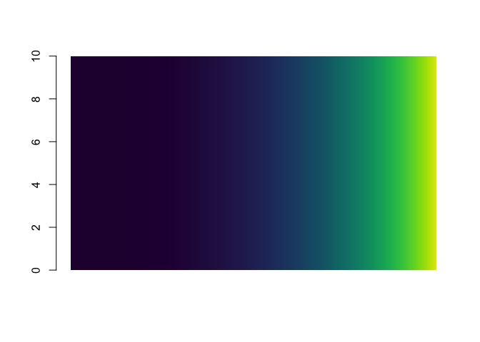
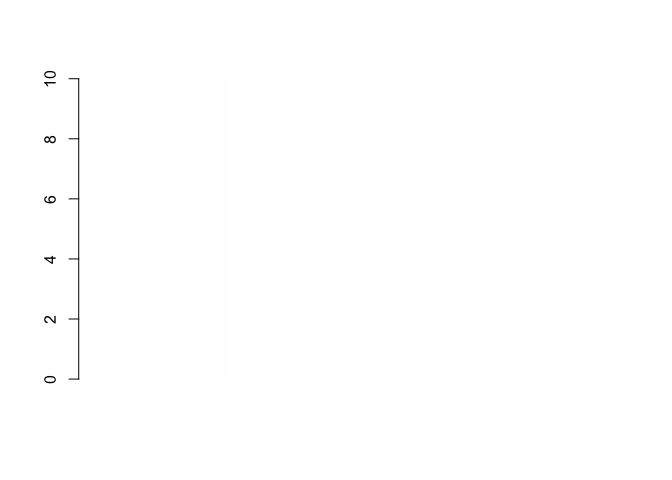
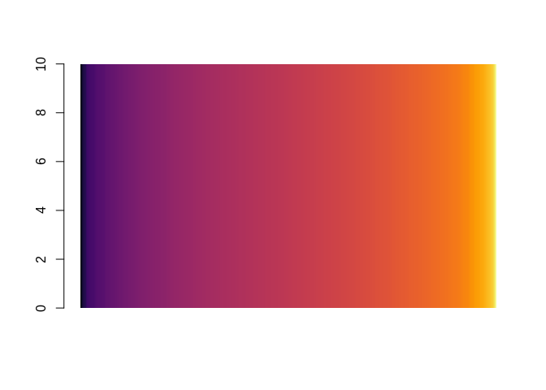
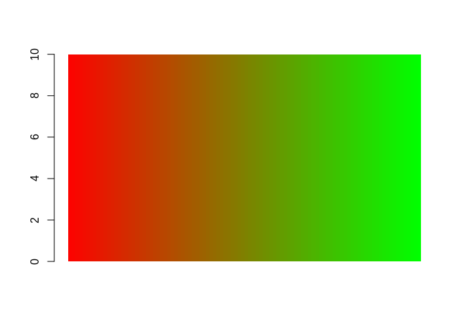
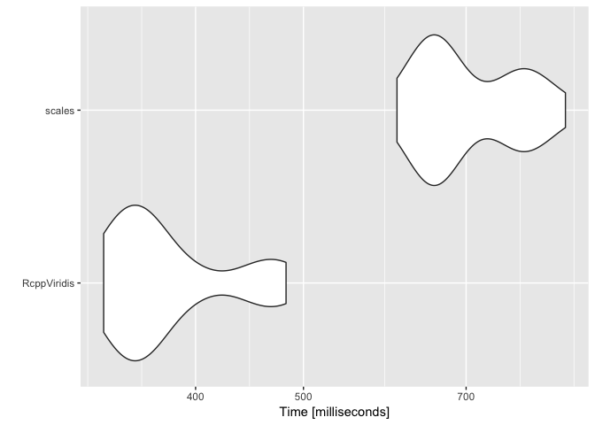
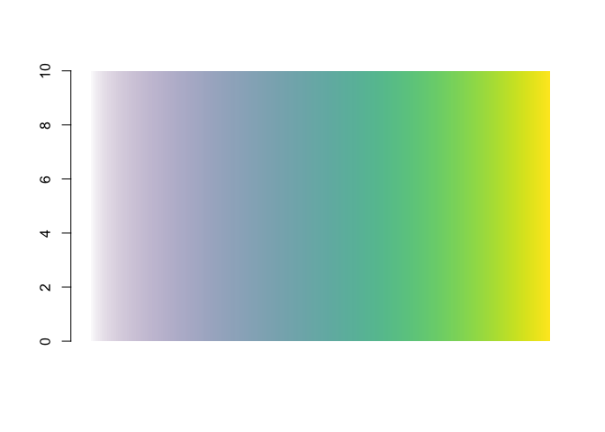
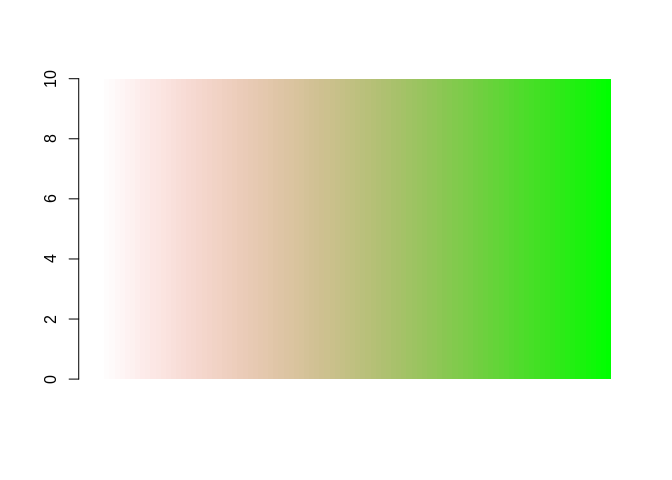
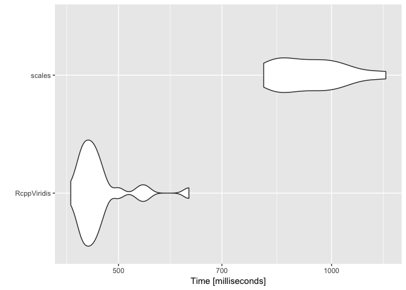
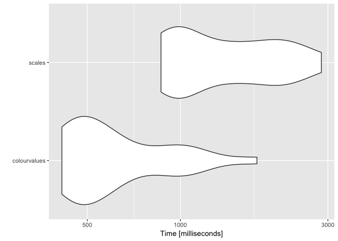
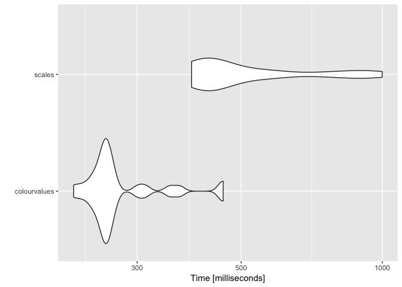

[](http://cran.r-project.org/package=colourvalues)

[](http://cran.r-project.org/web/packages/colourvalues/index.html)
[](https://travis-ci.org/SymbolixAU/colourvalues)
[](https://codecov.io/github/SymbolixAU/colourvalues?branch=master)
[](https://github.com/SymbolixAU/colourvalues)

<!-- README.md is generated from README.Rmd. Please edit that file -->

# colourvalues

-----

### What does it do?

It maps viridis colours (by default) to values, and quickly\!

**Note** It does not perform a 1-to-1 mapping of a palette to values. It
interpolates the colours from a given palette.

### Why did you build it?

I’m aware there are other methods for mapping colours to values. And
which do it quick too. But I can never remember them, and I find the
interfaces a bit cumbersome. For example, `scales::col_numeric(palette =
viridisLite::viridis(5), domain = range(1:5))(1:5)`.

I wanted **one** function which will work on **one** argument.

``` r
colour_values(1:5)
# [1] "#440154FF" "#3B528BFF" "#21908CFF" "#5DC963FF" "#FDE725FF"
colour_values(letters[1:5])
# [1] "#440154FF" "#3B528BFF" "#21908CFF" "#5DC963FF" "#FDE725FF"
```

I also want it available at the `src` (C/C++) level for linking to other
packages.

-----

### Why do you spell colour with a ‘u’?

Because it’s correct, and [R tells us
to](http://developer.r-project.org/Rds.html)

> For consistency, aim to use British (rather than American) spelling

But don’t worry, `color_values(1:5)` works as well

-----

### How do I install it?

From CRAN

``` r
install.packages("colourvalues")
```

Or install the development version from
[GitHub](https://github.com/SymbolixAU/colourvalues) with:

``` r
# install.packages("devtools")
devtools::install_github("SymbolixAU/colourvalues")
```

-----

### How can I make use of it in my package?

**Rcpp**

All functions are written in `Rcpp`. I have exposed some of them in
header files so you can “link to” them in your package.

For example, the `LinkingTo` section in `DESCRIPTION` will look
something like

``` yaml
LinkingTo: 
    Rcpp,
    colourvalues
```

And in a **c++** source file so you can `#include` a header and use the
available functions

``` cpp
#include "colourvalues/colours/colours_hex.hpp"
// [[Rcpp::depends(colourvalues)]]
```

**R**

If you’re not using `Rcpp`, just `Import` this package like you would
any other.

## Do you have any examples?

Of course\!

#### 256 numbers mapped to a colour

``` r
df <- data.frame(a = 10, x = 1:256)
df$col <- colour_values(df$x, palette = "viridis")
barplot(height = df$a, col = df$col, border = NA, space = 0)
```



#### 5000 numbers on a non-linear scale

``` r
df <- data.frame(a = 10, x = c((1:5000)**3))
df$col <- colour_values(df$x, palette = "viridis")
barplot(height = df$a, col = df$col, border = NA, space = 0)
```



#### 1000 random numbers

``` r
df <- data.frame(a = 10, x = rnorm(n = 1000))
df$col <- colour_values(df$x, palette = "inferno")
barplot(height = df$a, col = df$col, border = NA, space = 0)
```



Eurgh\!

``` r
df <- df[with(df, order(x)), ]
barplot(height = df$a, col = df$col, border = NA, space = 0)
```



That’s better\!

-----

## Do I have to use the in-built palettes?

No, you can use your own specified as a matrix of red, green and blue
columns in the range \[0,255\]

``` r
n <- 100
m <- grDevices::colorRamp(c("red", "green"))( (1:n)/n )
df <- data.frame(a = 10, x = 1:n)
df$col <- colour_values(df$x, palette = m)
barplot(height = df$a, col = df$col, border = NA, space = 0)
```



## Do you support ‘alpha’ values

Yep. Either supply a single alpha value for all the colours

``` r
## single alpha value for all colours
df <- data.frame(a = 10, x = 1:255)
df$col <- colour_values(df$x, alpha = 50)
barplot(height = df$a, col = df$col, border = NA, space = 0)
```



Or use a vector of values the same length as `x`

``` r
df <- data.frame(a = 10, x = 1:300, y = rep(c(1:50, 50:1), 3) )
df$col <- colour_values(df$x, alpha = df$y)
barplot(height = df$a, col = df$col, border = NA, space = 0)
```



Or include the alpha value as a 4th column in the palette matrix

``` r
n <- 100
m <- grDevices::colorRamp(c("red", "green"))( (1:n)/n )
## alpha values
m <- cbind(m, seq(0, 255, length.out = 100))
df <- data.frame(a = 10, x = 1:n)
df$col <- colour_values(df$x, palette = m)
barplot(height = df$a, col = df$col, border = NA, space = 0)
```



## Some of my plotting functions don’t support alpha, can I exclude it?

Yep. Set `include_alpha = FALSE`

``` r
colour_values(1:5, include_alpha = F)
# [1] "#440154" "#3B528B" "#21908C" "#5DC963" "#FDE725"
colour_values_rgb(1:5, include_alpha = F)
#      [,1] [,2] [,3]
# [1,]   68    1   84
# [2,]   59   82  139
# [3,]   33  144  140
# [4,]   93  201   99
# [5,]  253  231   37
```

## Can I get a summary of colours to use in a legend?

Yes, for numeric values use the `n_summaries` argument to specify the
number of summary values you’d like

``` r
colour_values(1:10, n_summaries = 3)
# $colours
#  [1] "#440154FF" "#482878FF" "#3E4A89FF" "#31688EFF" "#26838EFF"
#  [6] "#1F9D89FF" "#35B779FF" "#6CCE59FF" "#B4DD2CFF" "#FDE725FF"
# 
# $summary_values
# [1] "1.00"  "5.50"  "10.00"
# 
# $summary_colours
# [1] "#440154FF" "#21908CFF" "#FDE725FF"
```

You can also specify the number of digits you’d like returned in the
summary

``` r
colour_values(rnorm(n = 10), n_summaries = 3, digits = 2)
# $colours
#  [1] "#20918CFF" "#98D83EFF" "#26838EFF" "#B3DD2CFF" "#B3DD2DFF"
#  [6] "#2C738EFF" "#FDE725FF" "#355E8DFF" "#B7DE2AFF" "#440154FF"
# 
# $summary_values
# [1] "-2.76" "-1.17" "0.41" 
# 
# $summary_colours
# [1] "#440154FF" "#21908CFF" "#FDE725FF"
```

You can also use `format = FALSE` if you don’t want the summary values
formatted.

``` r
dte <- seq(as.Date("2018-01-01"), as.Date("2018-02-01"), by = 1)
colour_values(dte, n_summaries = 3)
# $colours
#  [1] "#440154FF" "#470D60FF" "#48196BFF" "#482474FF" "#472E7CFF"
#  [6] "#453882FF" "#414286FF" "#3E4B8AFF" "#3A548CFF" "#365D8DFF"
# [11] "#32658EFF" "#2E6D8EFF" "#2B758EFF" "#287D8EFF" "#25858EFF"
# [16] "#228C8DFF" "#20948CFF" "#1E9C89FF" "#20A386FF" "#25AB82FF"
# [21] "#2DB27DFF" "#39BA76FF" "#48C16EFF" "#58C765FF" "#6ACD5BFF"
# [26] "#7ED34FFF" "#92D742FF" "#A8DB34FF" "#BEDF26FF" "#D4E21BFF"
# [31] "#E9E41AFF" "#FDE725FF"
# 
# $summary_values
# [1] "2018-01-01" "2018-01-16" "2018-02-01"
# 
# $summary_colours
# [1] "#440154FF" "#21908CFF" "#FDE725FF"

colour_values(dte, n_summaries = 3, format = F)
# $colours
#  [1] "#440154FF" "#470D60FF" "#48196BFF" "#482474FF" "#472E7CFF"
#  [6] "#453882FF" "#414286FF" "#3E4B8AFF" "#3A548CFF" "#365D8DFF"
# [11] "#32658EFF" "#2E6D8EFF" "#2B758EFF" "#287D8EFF" "#25858EFF"
# [16] "#228C8DFF" "#20948CFF" "#1E9C89FF" "#20A386FF" "#25AB82FF"
# [21] "#2DB27DFF" "#39BA76FF" "#48C16EFF" "#58C765FF" "#6ACD5BFF"
# [26] "#7ED34FFF" "#92D742FF" "#A8DB34FF" "#BEDF26FF" "#D4E21BFF"
# [31] "#E9E41AFF" "#FDE725FF"
# 
# $summary_values
# [1] 17532.0 17547.5 17563.0
# 
# $summary_colours
# [1] "#440154FF" "#21908CFF" "#FDE725FF"
```

For categorical values use `summary = TRUE` to return a uniqe set of the
values, and their associated colours

``` r
colour_values(sample(letters, size = 50, replace = T), summary = T)
# $colours
#  [1] "#440154FF" "#31688EFF" "#C7E020FF" "#481F71FF" "#FDE725FF"
#  [6] "#472D7BFF" "#472D7BFF" "#3B528BFF" "#471163FF" "#E3E418FF"
# [11] "#8FD744FF" "#E3E418FF" "#472D7BFF" "#2C728EFF" "#20A486FF"
# [16] "#ABDC32FF" "#2C728EFF" "#24868EFF" "#35B779FF" "#28AE80FF"
# [21] "#ABDC32FF" "#E3E418FF" "#24868EFF" "#31688EFF" "#47C06FFF"
# [26] "#20A486FF" "#404688FF" "#24868EFF" "#28AE80FF" "#443A83FF"
# [31] "#47C06FFF" "#3B528BFF" "#75D054FF" "#404688FF" "#404688FF"
# [36] "#481F71FF" "#287C8EFF" "#20A486FF" "#5DC963FF" "#ABDC32FF"
# [41] "#1F9A8AFF" "#443A83FF" "#355D8DFF" "#28AE80FF" "#E3E418FF"
# [46] "#28AE80FF" "#8FD744FF" "#21908CFF" "#28AE80FF" "#8FD744FF"
# 
# $summary_values
#  [1] "a" "b" "c" "d" "e" "f" "g" "h" "i" "j" "k" "m" "n" "o" "p" "q" "r"
# [18] "s" "t" "u" "v" "w" "x" "y" "z"
# 
# $summary_colours
#  [1] "#440154FF" "#471163FF" "#481F71FF" "#472D7BFF" "#443A83FF"
#  [6] "#404688FF" "#3B528BFF" "#355D8DFF" "#31688EFF" "#2C728EFF"
# [11] "#287C8EFF" "#24868EFF" "#21908CFF" "#1F9A8AFF" "#20A486FF"
# [16] "#28AE80FF" "#35B779FF" "#47C06FFF" "#5DC963FF" "#75D054FF"
# [21] "#8FD744FF" "#ABDC32FF" "#C7E020FF" "#E3E418FF" "#FDE725FF"
```

-----

### What’s the performance like?

**10 million numeric values**

``` r
library(microbenchmark)
library(ggplot2)
library(scales)
library(viridisLite)
# 
# Attaching package: 'viridisLite'
# The following objects are masked from 'package:colourvalues':
# 
#     cividis, inferno, magma, plasma, viridis

n <- 1e7
df <- data.frame(x = rnorm(n = n))

m <- microbenchmark(
  colourvalues = { colourvalues::colour_values(x = df$x) },
  scales = { col_numeric(palette = rgb(subset(viridis.map, opt=="D")[, 1:3]), domain = range(df$x))(df$x) },
  times = 25
)
m
# Unit: seconds
#          expr      min       lq     mean   median       uq      max neval
#  colourvalues 1.617392 1.650307 1.707740 1.688513 1.757597 1.866051    25
#        scales 2.772918 2.889632 2.958089 2.922623 3.016068 3.344712    25

autoplot(m)
# Coordinate system already present. Adding new coordinate system, which will replace the existing one.
```



**1 million characters (26 unique values)**

``` r
library(microbenchmark)
library(ggplot2)
library(scales)
library(viridisLite)

n <- 1e6
x <- sample(x = letters, size = n, replace = TRUE)
df <- data.frame(x = x)

m <- microbenchmark(
  colourvalues = { x <- colourvalues::colour_values(x = df$x) },
  scales = { y <- col_factor(palette = rgb(subset(viridis.map, opt=="D")[, 1:3]), domain = unique(df$x))(df$x) },
  times = 25
)
m
# Unit: milliseconds
#          expr      min       lq     mean   median       uq      max neval
#  colourvalues 183.6266 191.3288 196.3723 192.1881 192.8737 304.3512    25
#        scales 288.9669 311.4043 320.7450 313.7732 318.0472 378.1733    25

autoplot(m)
# Coordinate system already present. Adding new coordinate system, which will replace the existing one.
```


