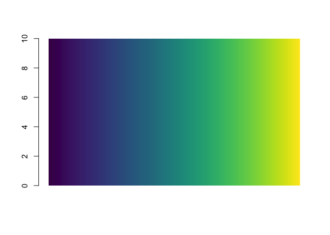
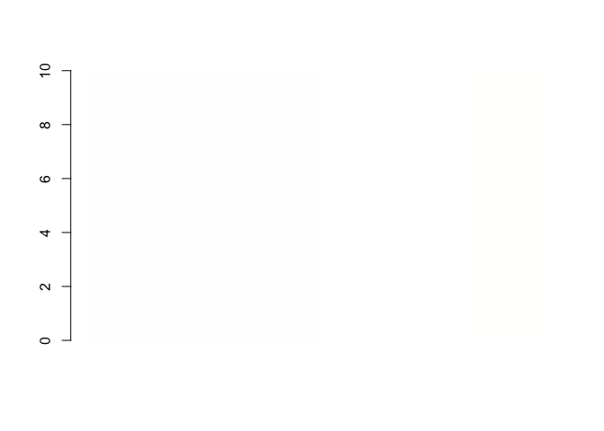

<!-- README.md is generated from README.Rmd. Please edit that file -->

# RcppViridis

RcppViridis is designed to map viridis colours to variables, and
quickly\!

## Installation

Install the development version from
[GitHub](https://github.com/SymbolixAU/RcppViridis) with:

``` r
# install.packages("devtools")
devtools::install_github("SymbolixAU/RcppViridis")
```

## Example

``` r
df <- data.frame(a = 10, x = 1:256)
df$col <- colour_variables(df$x, palette = "viridis")
barplot(height = df$a, col = df$col, border = NA, space = 0)
```



``` r
df <- data.frame(a = 10, x = 1:256)
df$col <- colour_variables(df$x, palette = "plasma")
barplot(height = df$a, col = df$col, border = NA, space = 0)
```



``` r
df <- data.frame(a = 10, x = 1:256)
df$col <- colour_variables(df$x, palette = "magma")
barplot(height = df$a, col = df$col, border = NA, space = 0)
```


``` r
df <- data.frame(a = 10, x = 1:256)
df$col <- colour_variables(df$x, palette = "inferno")
barplot(height = df$a, col = df$col, border = NA, space = 0)
```


``` r
df <- data.frame(a = 10, x = 1:256)
df$col <- colour_variables(df$x, palette = "cividis")
barplot(height = df$a, col = df$col, border = NA, space = 0)
```


