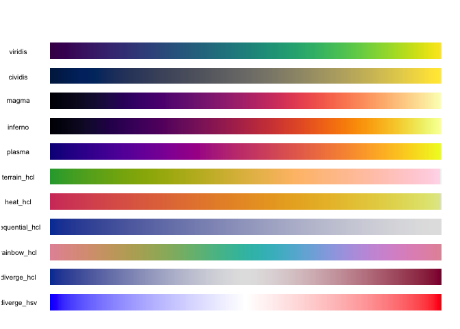

[](https://travis-ci.org/SymbolixAU/RcppViridis)
[](https://codecov.io/github/SymbolixAU/RcppViridis?branch=master)
[](https://github.com/SymbolixAU/RcppViridis)

<!-- README.md is generated from README.Rmd. Please edit that file -->

# RcppViridis

-----

### What does it do?

It maps viridis colours to variables, and quickly\!

### Why did you build it?

I’m aware there are other methods for mapping colours to values. And
which do it quick too. But I can never remember them, and I find the
interfaces a bit cumbersome. For example, `scales::col_numeric(palette =
viridisLite::viridis(5), domain = range(1:5))(1:5)`.

I wanted **one** function which will work on **one** argument.

``` r
colour_values(1:5)
# [1] "#440154FF" "#3B528BFF" "#21908CFF" "#5DC963FF" "#FDE725FF"
colour_values(letters[1:5])
# [1] "#440154FF" "#3B528BFF" "#21908CFF" "#5DC963FF" "#FDE725FF"
```

I also want it available at the `src` (C/C++) level for linking to other
packages.

-----

### Why do you spell colour with a ‘u’?

Because it’s correct, and [R tells us
to](http://developer.r-project.org/Rds.html)

> For consistency, aim to use British (rather than American) spelling

But don’t worry, `color_values(1:5)` works as well

-----

### How do I install it?

Install the development version from
[GitHub](https://github.com/SymbolixAU/RcppViridis) with:

``` r
# install.packages("devtools")
devtools::install_github("SymbolixAU/RcppViridis")
```

-----

### How can I make use of it in my package?

**Rcpp**

All functions are written in `Rcpp`. I have exposed some of them in
header files so you can `LinkTo` them in your package.

For example, the `LinkingTo` section in `DESCRIPTION` will look
something like

``` yaml
LinkingTo: 
    Rcpp,
    RcppViridis
```

And in a **c++** source file you can `#include` a header and use the
avaialble functions

``` cpp
#include "RcppViridis/colours/colours_hex.hpp"
// [[Rcpp::depends(RcppViridis)]]
```

**R**

If you’re not using `Rcpp`, just `Import` this package like you would
any other.

## Do you have any examples?

Of course\!

#### 256 numbers mapped to a colour

``` r
df <- data.frame(a = 10, x = 1:256)
df$col <- colour_values(df$x, palette = "viridis")
barplot(height = df$a, col = df$col, border = NA, space = 0)
```


#### 5000 numbers on a non-linear scale

``` r
df <- data.frame(a = 10, x = c((1:5000)**3))
df$col <- colour_values(df$x, palette = "viridis")
barplot(height = df$a, col = df$col, border = NA, space = 0)
```


#### 1000 random numbers

``` r
df <- data.frame(a = 10, x = rnorm(n = 1000))
df$col <- colour_values(df$x, palette = "inferno")
barplot(height = df$a, col = df$col, border = NA, space = 0)
```


Eurgh\!

``` r
df <- df[with(df, order(x)), ]
barplot(height = df$a, col = df$col, border = NA, space = 0)
```


That’s better\!

-----

## Do I have to use the in-built palettes?

No, you can use your own specified as a matrix of red, green and blue
columns in the range \[0,255\]

``` r
n <- 100
m <- grDevices::colorRamp(c("red", "green"))( (1:n)/n )
df <- data.frame(a = 10, x = 1:n)
df$col <- colour_values(df$x, palette = m)
barplot(height = df$a, col = df$col, border = NA, space = 0)
```


## Do you support ‘alpha’ values

Yep. Either supply a single alpha value for all the colours

``` r
## single alpha value for all colours
df <- data.frame(a = 10, x = 1:255)
df$col <- colour_values(df$x, alpha = 50)
barplot(height = df$a, col = df$col, border = NA, space = 0)
```


Or include the alpha value as a 4th column in the palette matrix

``` r
n <- 100
m <- grDevices::colorRamp(c("red", "green"))( (1:n)/n )
## alpha values
m <- cbind(m, seq(0, 255, length.out = 100))
df <- data.frame(a = 10, x = 1:n)
df$col <- colour_values(df$x, palette = m)
barplot(height = df$a, col = df$col, border = NA, space = 0)
```


-----

### What’s the performance like?

**1 million numeric values**

``` r
library(microbenchmark)
library(ggplot2)
library(scales)
library(viridisLite)

n <- 1e6
df <- data.frame(x = rnorm(n = n))

m <- microbenchmark(
  RcppViridis = { RcppViridis::colour_values(x = df$x) },
  scales = { col_numeric(palette = rgb(subset(viridis.map, opt=="D")[, 1:3]), domain = range(df$x))(df$x) },
  times = 25
)
m
# Unit: milliseconds
#         expr      min       lq     mean   median       uq      max neval
#  RcppViridis 307.0600 326.5560 346.4355 333.8038 367.8085 437.9861    25
#       scales 599.7883 638.9846 687.2668 671.1691 718.0140 809.6930    25

autoplot(m)
```



**1 million characters (26 unique values)**

``` r
library(microbenchmark)
library(ggplot2)
library(scales)
library(viridisLite)

n <- 1e6
x <- sample(x = letters, size = n, replace = TRUE)
df <- data.frame(x = x)

m <- microbenchmark(
  RcppViridis = { x <- RcppViridis::colour_values(x = df$x) },
  scales = { y <- col_factor(palette = rgb(subset(viridis.map, opt=="D")[, 1:3]), domain = unique(df$x))(df$x) },
  times = 25
)
m
# Unit: milliseconds
#         expr      min       lq     mean   median       uq      max neval
#  RcppViridis 328.6547 343.5471 365.7754 352.5738 363.4435 479.9522    25
#       scales 589.4901 635.6974 688.5299 666.3140 734.8600 859.4748    25

autoplot(m)
```


